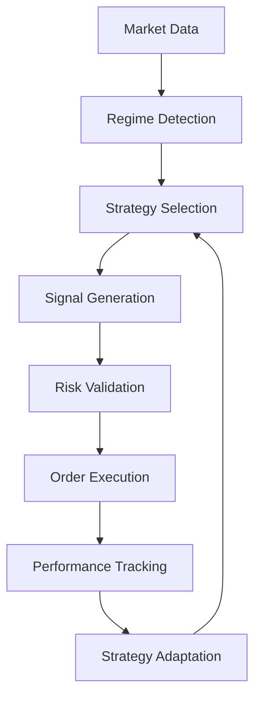

# 🎯 NeuroCluster Elite Strategy Development Guide

Learn how to develop, test, and deploy custom trading strategies using the NeuroCluster Elite platform's powerful AI-driven framework.

## 📋 Table of Contents

- [Strategy Architecture](#strategy-architecture)
- [Getting Started](#getting-started)
- [Base Strategy Class](#base-strategy-class)
- [Signal Generation](#signal-generation)
- [Risk Management Integration](#risk-management-integration)
- [Backtesting Strategies](#backtesting-strategies)
- [Advanced Techniques](#advanced-techniques)
- [Performance Optimization](#performance-optimization)
- [Example Strategies](#example-strategies)
- [Best Practices](#best-practices)
- [Deployment Guide](#deployment-guide)

---

## 🏗️ Strategy Architecture

### Core Components

The NeuroCluster Elite strategy framework consists of several key components:

```
Strategy Framework
├── 🎯 Base Strategy Class
│   ├── Signal Generation Logic
│   ├── Risk Management Integration
│   ├── Performance Tracking
│   └── Configuration Management
├── 📊 Technical Indicators
│   ├── Built-in Indicators
│   ├── Custom Indicators
│   └── Multi-timeframe Analysis
├── 🧠 Regime Detection
│   ├── NeuroCluster Integration
│   ├── Market State Analysis
│   └── Adaptive Parameters
└── ⚖️ Risk Controls
    ├── Position Sizing
    ├── Stop Loss/Take Profit
    └── Portfolio Constraints
```

### Strategy Lifecycle



---

## 🚀 Getting Started

### Environment Setup

```bash
# Clone the repository
git clone https://github.com/neurocluster-elite/neurocluster-elite.git
cd neurocluster-elite

# Install dependencies
pip install -e ".[dev]"

# Create strategy directory
mkdir my_strategies
cd my_strategies
```

### Basic Strategy Template

```python
#!/usr/bin/env python3
"""
Custom Strategy Template
"""

from src.trading.strategies.base_strategy import BaseStrategy, TradingSignal, SignalType
from src.core.neurocluster_elite import RegimeType, AssetType, MarketData
from typing import Optional
from datetime import datetime

class MyCustomStrategy(BaseStrategy):
    """
    Custom trading strategy implementation
    """
    
    def __init__(self, config: dict = None):
        super().__init__(config)
        self.name = "MyCustomStrategy"
        self.description = "A custom strategy for specific market conditions"
        
        # Strategy-specific parameters
        self.min_confidence = config.get('min_confidence', 0.7)
        self.lookback_period = config.get('lookback_period', 20)
    
    def generate_signal(
        self, 
        data: MarketData, 
        regime: RegimeType, 
        confidence: float
    ) -> Optional[TradingSignal]:
        """
        Generate trading signal based on market data and regime
        """
        
        # 1. Check if conditions are met
        if not self._should_trade(data, regime, confidence):
            return None
        
        # 2. Determine signal type
        signal_type = self._analyze_market_direction(data)
        if signal_type is None:
            return None
        
        # 3. Calculate entry price and levels
        entry_price = self._calculate_entry_price(data, signal_type)
        stop_loss = self._calculate_stop_loss(entry_price, signal_type)
        take_profit = self._calculate_take_profit(entry_price, signal_type)
        
        # 4. Calculate confidence
        signal_confidence = self._calculate_signal_confidence(data, regime, confidence)
        
        # 5. Create and return signal
        return self._create_signal(
            symbol=data.symbol,
            signal_type=signal_type,
            asset_type=data.asset_type,
            entry_price=entry_price,
            stop_loss=stop_loss,
            take_profit=take_profit,
            confidence=signal_confidence,
            data=data
        )
    
    def _should_trade(self, data: MarketData, regime: RegimeType, confidence: float) -> bool:
        """Check if trading conditions are met"""
        
        # Minimum confidence threshold
        if confidence < self.min_confidence:
            return False
        
        # Check data quality
        if not self._validate_data_quality(data):
            return False
        
        # Check market hours (for stocks)
        if data.asset_type == AssetType.STOCK and not self._is_market_open():
            return False
        
        return True
    
    def _analyze_market_direction(self, data: MarketData) -> Optional[SignalType]:
        """Analyze market direction and determine signal type"""
        
        # Example: Simple momentum strategy
        if hasattr(data, 'rsi') and hasattr(data, 'macd'):
            # Bullish conditions
            if data.rsi < 70 and data.macd > 0 and data.change_percent > 1.0:
                return SignalType.BUY
            
            # Bearish conditions
            elif data.rsi > 30 and data.macd < 0 and data.change_percent < -1.0:
                return SignalType.SELL
        
        return None
    
    def _calculate_signal_confidence(
        self, 
        data: MarketData, 
        regime: RegimeType, 
        regime_confidence: float
    ) -> float:
        """Calculate signal confidence based on multiple factors"""
        
        confidence_factors = []
        
        # Volume confirmation
        if hasattr(data, 'volume') and data.volume > 0:
            avg_volume = getattr(data, 'avg_volume', data.volume)
            volume_ratio = data.volume / avg_volume
            confidence_factors.append(min(volume_ratio / 2.0, 1.0))
        
        # Technical indicator alignment
        if hasattr(data, 'rsi') and hasattr(data, 'macd'):
            tech_confidence = self._calculate_technical_confidence(data)
            confidence_factors.append(tech_confidence)
        
        # Regime alignment
        confidence_factors.append(regime_confidence)
        
        # Calculate weighted average
        if confidence_factors:
            return sum(confidence_factors) / len(confidence_factors)
        
        return 0.5  # Default moderate confidence
```

---

## 📊 Base Strategy Class

### Inheritance Structure

All strategies inherit from the `BaseStrategy` class which provides core functionality:

```python
class BaseStrategy:
    """
    Base class for all trading strategies
    """
    
    def __init__(self, config: dict = None):
        self.config = config or {}
        self.name = "BaseStrategy"
        self.description = "Base strategy class"
        self.metrics = StrategyMetrics()
        
        # Common parameters
        self.stop_loss_pct = config.get('stop_loss_pct', 0.05)
        self.take_profit_pct = config.get('take_profit_pct', 0.10)
        self.max_position_size = config.get('max_position_size', 0.1)
    
    def generate_signal(
        self, 
        data: MarketData, 
        regime: RegimeType, 
        confidence: float
    ) -> Optional[TradingSignal]:
        """Override this method in your strategy"""
        raise NotImplementedError
    
    def _create_signal(self, **kwargs) -> TradingSignal:
        """Helper method to create trading signals"""
        # Implementation provided by base class
    
    def _calculate_stop_loss(self, entry_price: float, signal_type: SignalType) -> float:
        """Calculate stop loss level"""
        # Implementation provided by base class
    
    def _calculate_take_profit(self, entry_price: float, signal_type: SignalType) -> float:
        """Calculate take profit level"""
        # Implementation provided by base class
```

### Core Methods to Override

1. **`generate_signal()`** - Main signal generation logic (required)
2. **`validate_signal()`** - Additional signal validation (optional)
3. **`update_parameters()`** - Dynamic parameter adjustment (optional)
4. **`get_required_indicators()`** - Specify required technical indicators (optional)

---

## 🎯 Signal Generation

### Signal Structure

```python
@dataclass
class TradingSignal:
    symbol: str
    signal_type: SignalType  # BUY, SELL, HOLD
    asset_type: AssetType
    entry_price: float
    stop_loss: Optional[float] = None
    take_profit: Optional[float] = None
    confidence: float = 0.0
    timestamp: datetime = field(default_factory=datetime.now)
    strategy_name: str = ""
    volume_confirmation: bool = False
    risk_reward_ratio: float = 0.0
    notes: str = ""
```

### Signal Generation Patterns

#### 1. Momentum Strategy Example

```python
def generate_signal(self, data: MarketData, regime: RegimeType, confidence: float) -> Optional[TradingSignal]:
    """Momentum-based signal generation"""
    
    # Only trade in trending markets
    if regime not in [RegimeType.BULL, RegimeType.BEAR]:
        return None
    
    # Calculate momentum indicators
    price_momentum = self._calculate_price_momentum(data)
    volume_momentum = self._calculate_volume_momentum(data)
    
    # Generate buy signal
    if (regime == RegimeType.BULL and 
        price_momentum > 0.02 and 
        volume_momentum > 1.5 and
        data.rsi < 80):
        
        return self._create_signal(
            symbol=data.symbol,
            signal_type=SignalType.BUY,
            asset_type=data.asset_type,
            entry_price=data.price,
            confidence=min(0.9, confidence * price_momentum * 10),
            data=data
        )
    
    # Generate sell signal
    elif (regime == RegimeType.BEAR and 
          price_momentum < -0.02 and 
          volume_momentum > 1.5 and
          data.rsi > 20):
        
        return self._create_signal(
            symbol=data.symbol,
            signal_type=SignalType.SELL,
            asset_type=data.asset_type,
            entry_price=data.price,
            confidence=min(0.9, confidence * abs(price_momentum) * 10),
            data=data
        )
    
    return None
```

#### 2. Mean Reversion Strategy Example

```python
def generate_signal(self, data: MarketData, regime: RegimeType, confidence: float) -> Optional[TradingSignal]:
    """Mean reversion signal generation"""
    
    # Only trade in ranging markets
    if regime != RegimeType.SIDEWAYS:
        return None
    
    # Calculate mean reversion indicators
    bb_position = self._calculate_bollinger_position(data)
    rsi_divergence = self._calculate_rsi_divergence(data)
    
    # Oversold bounce signal
    if (bb_position < 0.1 and  # Near lower Bollinger Band
        data.rsi < 30 and      # Oversold
        rsi_divergence > 0):   # Bullish divergence
        
        return self._create_signal(
            symbol=data.symbol,
            signal_type=SignalType.BUY,
            asset_type=data.asset_type,
            entry_price=data.price,
            confidence=0.8 * confidence,
            data=data
        )
    
    # Overbought pullback signal
    elif (bb_position > 0.9 and  # Near upper Bollinger Band
          data.rsi > 70 and      # Overbought
          rsi_divergence < 0):   # Bearish divergence
        
        return self._create_signal(
            symbol=data.symbol,
            signal_type=SignalType.SELL,
            asset_type=data.asset_type,
            entry_price=data.price,
            confidence=0.8 * confidence,
            data=data
        )
    
    return None
```

#### 3. Breakout Strategy Example

```python
def generate_signal(self, data: MarketData, regime: RegimeType, confidence: float) -> Optional[TradingSignal]:
    """Breakout signal generation"""
    
    # Get support/resistance levels
    support_levels, resistance_levels = self._get_key_levels(data.symbol)
    
    # Check for resistance breakout
    nearest_resistance = min(resistance_levels, key=lambda x: abs(x - data.price))
    if (data.price > nearest_resistance * 1.01 and  # Clean breakout
        data.volume > self._get_average_volume(data.symbol) * 2):  # High volume
        
        return self._create_signal(
            symbol=data.symbol,
            signal_type=SignalType.BUY,
            asset_type=data.asset_type,
            entry_price=data.price,
            stop_loss=nearest_resistance * 0.99,  # Below broken resistance
            take_profit=data.price * 1.08,  # 8% target
            confidence=0.9 * confidence,
            data=data
        )
    
    # Check for support breakdown
    nearest_support = min(support_levels, key=lambda x: abs(x - data.price))
    if (data.price < nearest_support * 0.99 and  # Clean breakdown
        data.volume > self._get_average_volume(data.symbol) * 2):  # High volume
        
        return self._create_signal(
            symbol=data.symbol,
            signal_type=SignalType.SELL,
            asset_type=data.asset_type,
            entry_price=data.price,
            stop_loss=nearest_support * 1.01,  # Above broken support
            take_profit=data.price * 0.92,  # 8% target
            confidence=0.9 * confidence,
            data=data
        )
    
    return None
```

---

## ⚖️ Risk Management Integration

### Position Sizing

Strategies can integrate with the risk management system for optimal position sizing:

```python
class RiskAwareStrategy(BaseStrategy):
    """Strategy with integrated risk management"""
    
    def generate_signal(self, data: MarketData, regime: RegimeType, confidence: float) -> Optional[TradingSignal]:
        signal = super().generate_signal(data, regime, confidence)
        
        if signal:
            # Calculate risk-adjusted position size
            signal.position_size = self._calculate_position_size(signal, data)
            
            # Adjust based on volatility
            signal.position_size *= self._volatility_adjustment(data)
            
            # Ensure within risk limits
            signal.position_size = min(signal.position_size, self.max_position_size)
        
        return signal
    
    def _calculate_position_size(self, signal: TradingSignal, data: MarketData) -> float:
        """Calculate position size using Kelly Criterion"""
        
        # Historical win rate and average returns (from backtesting)
        win_rate = self.metrics.win_rate or 0.55
        avg_win = self.metrics.avg_winning_trade or 0.05
        avg_loss = abs(self.metrics.avg_losing_trade or -0.025)
        
        # Kelly Criterion formula
        if avg_loss > 0:
            kelly_fraction = (win_rate * avg_win - (1 - win_rate) * avg_loss) / avg_win
            return max(0, min(kelly_fraction, self.max_position_size))
        
        return self.max_position_size * 0.5  # Conservative default
    
    def _volatility_adjustment(self, data: MarketData) -> float:
        """Adjust position size based on volatility"""
        
        if hasattr(data, 'volatility') and data.volatility > 0:
            # Reduce size for high volatility assets
            base_volatility = 0.2  # 20% base volatility
            vol_adjustment = base_volatility / data.volatility
            return min(1.0, max(0.1, vol_adjustment))
        
        return 1.0  # No adjustment if volatility unknown
```

### Dynamic Stop Losses

```python
def _calculate_dynamic_stop_loss(self, data: MarketData, signal_type: SignalType) -> float:
    """Calculate dynamic stop loss based on volatility and support/resistance"""
    
    base_stop_pct = self.stop_loss_pct
    
    # Adjust for volatility
    if hasattr(data, 'volatility') and data.volatility > 0:
        vol_adjustment = min(2.0, data.volatility / 0.2)  # Scale by normal volatility
        adjusted_stop_pct = base_stop_pct * vol_adjustment
    else:
        adjusted_stop_pct = base_stop_pct
    
    # Calculate price-based stop
    if signal_type == SignalType.BUY:
        price_stop = data.price * (1 - adjusted_stop_pct)
        
        # Use support level if closer
        support_levels = self._get_support_levels(data.symbol)
        if support_levels:
            nearest_support = max([s for s in support_levels if s < data.price], default=0)
            if nearest_support > price_stop:
                return nearest_support * 0.99  # Slightly below support
        
        return price_stop
    
    else:  # SELL signal
        price_stop = data.price * (1 + adjusted_stop_pct)
        
        # Use resistance level if closer
        resistance_levels = self._get_resistance_levels(data.symbol)
        if resistance_levels:
            nearest_resistance = min([r for r in resistance_levels if r > data.price], default=float('inf'))
            if nearest_resistance < price_stop:
                return nearest_resistance * 1.01  # Slightly above resistance
        
        return price_stop
```

---

## 📈 Backtesting Strategies

### Backtesting Framework

```python
class StrategyBacktester:
    """Comprehensive strategy backtesting framework"""
    
    def __init__(self, strategy: BaseStrategy, initial_capital: float = 100000):
        self.strategy = strategy
        self.initial_capital = initial_capital
        self.current_capital = initial_capital
        self.positions = {}
        self.trades = []
    
    def run_backtest(
        self, 
        historical_data: pd.DataFrame, 
        start_date: str = None, 
        end_date: str = None
    ) -> dict:
        """Run comprehensive backtest"""
        
        # Filter data by date range
        if start_date:
            historical_data = historical_data[historical_data.index >= start_date]
        if end_date:
            historical_data = historical_data[historical_data.index <= end_date]
        
        results = {
            'trades': [],
            'daily_returns': [],
            'portfolio_values': []
        }
        
        for i, (date, row) in enumerate(historical_data.iterrows()):
            # Create market data object
            market_data = self._row_to_market_data(row)
            
            # Get regime (simplified for backtesting)
            regime = self._detect_regime(historical_data.iloc[max(0, i-20):i+1])
            
            # Generate signal
            signal = self.strategy.generate_signal(market_data, regime, 0.8)
            
            if signal:
                # Execute trade
                trade_result = self._execute_backtest_trade(signal, market_data)
                if trade_result:
                    results['trades'].append(trade_result)
            
            # Update portfolio value
            portfolio_value = self._calculate_portfolio_value(market_data.price)
            results['portfolio_values'].append(portfolio_value)
            
            # Calculate daily return
            if i > 0:
                daily_return = (portfolio_value - prev_value) / prev_value
                results['daily_returns'].append(daily_return)
            
            prev_value = portfolio_value
        
        # Calculate performance metrics
        performance = self._calculate_performance_metrics(results)
        
        return {
            'performance': performance,
            'trades': results['trades'],
            'portfolio_values': results['portfolio_values'],
            'daily_returns': results['daily_returns']
        }
    
    def _calculate_performance_metrics(self, results: dict) -> dict:
        """Calculate comprehensive performance metrics"""
        
        if not results['daily_returns']:
            return {}
        
        returns = pd.Series(results['daily_returns'])
        portfolio_values = pd.Series(results['portfolio_values'])
        
        # Basic metrics
        total_return = (portfolio_values.iloc[-1] - self.initial_capital) / self.initial_capital
        annualized_return = (1 + total_return) ** (252 / len(returns)) - 1
        volatility = returns.std() * np.sqrt(252)
        
        # Risk metrics
        sharpe_ratio = (annualized_return - 0.02) / volatility if volatility > 0 else 0
        max_drawdown = self._calculate_max_drawdown(portfolio_values)
        
        # Trade metrics
        trades = results['trades']
        winning_trades = [t for t in trades if t['pnl'] > 0]
        win_rate = len(winning_trades) / len(trades) if trades else 0
        
        return {
            'total_return': total_return,
            'annualized_return': annualized_return,
            'volatility': volatility,
            'sharpe_ratio': sharpe_ratio,
            'max_drawdown': max_drawdown,
            'win_rate': win_rate,
            'total_trades': len(trades),
            'profit_factor': self._calculate_profit_factor(trades)
        }
```

### Walk-Forward Analysis

```python
def walk_forward_analysis(
    self, 
    historical_data: pd.DataFrame, 
    train_periods: int = 252,  # 1 year
    test_periods: int = 63     # 3 months
) -> dict:
    """Perform walk-forward analysis"""
    
    results = []
    
    for i in range(train_periods, len(historical_data), test_periods):
        # Training period
        train_start = i - train_periods
        train_end = i
        train_data = historical_data.iloc[train_start:train_end]
        
        # Test period
        test_start = i
        test_end = min(i + test_periods, len(historical_data))
        test_data = historical_data.iloc[test_start:test_end]
        
        # Optimize strategy on training data
        optimized_params = self._optimize_parameters(train_data)
        
        # Test on out-of-sample data
        self.strategy.update_config(optimized_params)
        test_results = self.run_backtest(test_data)
        
        results.append({
            'train_period': (train_data.index[0], train_data.index[-1]),
            'test_period': (test_data.index[0], test_data.index[-1]),
            'optimized_params': optimized_params,
            'test_performance': test_results['performance']
        })
    
    return results
```

---

## 🧠 Advanced Techniques

### Multi-Timeframe Analysis

```python
class MultiTimeframeStrategy(BaseStrategy):
    """Strategy using multiple timeframes"""
    
    def __init__(self, config: dict = None):
        super().__init__(config)
        self.timeframes = ['1m', '5m', '15m', '1h', '1d']
        self.weights = [0.1, 0.15, 0.2, 0.25, 0.3]  # Higher weight for longer timeframes
    
    def generate_signal(self, data: MarketData, regime: RegimeType, confidence: float) -> Optional[TradingSignal]:
        """Generate signal using multiple timeframe analysis"""
        
        timeframe_signals = []
        
        for timeframe, weight in zip(self.timeframes, self.weights):
            # Get data for specific timeframe
            tf_data = self._get_timeframe_data(data.symbol, timeframe)
            
            # Analyze this timeframe
            tf_signal = self._analyze_timeframe(tf_data, regime)
            
            if tf_signal:
                timeframe_signals.append((tf_signal, weight))
        
        # Combine signals from all timeframes
        combined_signal = self._combine_timeframe_signals(timeframe_signals)
        
        if combined_signal and combined_signal['confidence'] > 0.7:
            return self._create_signal(
                symbol=data.symbol,
                signal_type=combined_signal['signal_type'],
                asset_type=data.asset_type,
                entry_price=data.price,
                confidence=combined_signal['confidence'],
                data=data
            )
        
        return None
    
    def _combine_timeframe_signals(self, signals: list) -> dict:
        """Combine signals from multiple timeframes"""
        
        if not signals:
            return None
        
        # Calculate weighted vote
        buy_weight = sum(weight for signal, weight in signals if signal['type'] == 'BUY')
        sell_weight = sum(weight for signal, weight in signals if signal['type'] == 'SELL')
        total_weight = buy_weight + sell_weight
        
        if total_weight == 0:
            return None
        
        # Determine final signal
        if buy_weight > sell_weight:
            signal_type = SignalType.BUY
            confidence = buy_weight / sum(self.weights)
        else:
            signal_type = SignalType.SELL
            confidence = sell_weight / sum(self.weights)
        
        return {
            'signal_type': signal_type,
            'confidence': confidence
        }
```

### Machine Learning Integration

```python
class MLEnhancedStrategy(BaseStrategy):
    """Strategy enhanced with machine learning"""
    
    def __init__(self, config: dict = None):
        super().__init__(config)
        self.model = None
        self.feature_columns = []
        self._initialize_model()
    
    def _initialize_model(self):
        """Initialize ML model"""
        from sklearn.ensemble import RandomForestClassifier
        
        self.model = RandomForestClassifier(
            n_estimators=100,
            max_depth=10,
            random_state=42
        )
        
        self.feature_columns = [
            'rsi', 'macd', 'bb_position', 'volume_ratio',
            'price_momentum', 'volatility', 'regime_confidence'
        ]
    
    def train_model(self, historical_data: pd.DataFrame):
        """Train ML model on historical data"""
        
        # Prepare features
        X = self._prepare_features(historical_data)
        
        # Prepare labels (future returns)
        y = self._prepare_labels(historical_data)
        
        # Train model
        self.model.fit(X, y)
        
        # Evaluate performance
        score = self.model.score(X, y)
        print(f"Model accuracy: {score:.3f}")
    
    def generate_signal(self, data: MarketData, regime: RegimeType, confidence: float) -> Optional[TradingSignal]:
        """Generate ML-enhanced signal"""
        
        if self.model is None:
            return super().generate_signal(data, regime, confidence)
        
        # Prepare features for prediction
        features = self._extract_features(data, regime, confidence)
        
        # Get ML prediction
        prediction = self.model.predict_proba([features])[0]
        
        # Convert prediction to signal
        if prediction[2] > 0.6:  # Strong buy
            signal_type = SignalType.BUY
            ml_confidence = prediction[2]
        elif prediction[0] > 0.6:  # Strong sell
            signal_type = SignalType.SELL
            ml_confidence = prediction[0]
        else:
            return None  # No clear signal
        
        # Combine with traditional analysis
        traditional_signal = super().generate_signal(data, regime, confidence)
        
        if traditional_signal and traditional_signal.signal_type == signal_type:
            # Signals agree - increase confidence
            final_confidence = min(0.95, (ml_confidence + traditional_signal.confidence) / 2)
            traditional_signal.confidence = final_confidence
            return traditional_signal
        
        return None  # Signals disagree - no trade
```

### Regime-Adaptive Parameters

```python
class AdaptiveStrategy(BaseStrategy):
    """Strategy with regime-adaptive parameters"""
    
    def __init__(self, config: dict = None):
        super().__init__(config)
        
        # Parameter sets for different regimes
        self.regime_params = {
            RegimeType.BULL: {
                'rsi_threshold': 70,
                'momentum_threshold': 0.02,
                'volume_multiplier': 1.5,
                'stop_loss_pct': 0.04,
                'take_profit_pct': 0.12
            },
            RegimeType.BEAR: {
                'rsi_threshold': 30,
                'momentum_threshold': -0.02,
                'volume_multiplier': 2.0,
                'stop_loss_pct': 0.06,
                'take_profit_pct': 0.08
            },
            RegimeType.SIDEWAYS: {
                'rsi_threshold': 50,
                'momentum_threshold': 0.01,
                'volume_multiplier': 1.2,
                'stop_loss_pct': 0.03,
                'take_profit_pct': 0.06
            },
            RegimeType.VOLATILE: {
                'rsi_threshold': 60,
                'momentum_threshold': 0.03,
                'volume_multiplier': 2.5,
                'stop_loss_pct': 0.08,
                'take_profit_pct': 0.15
            }
        }
    
    def generate_signal(self, data: MarketData, regime: RegimeType, confidence: float) -> Optional[TradingSignal]:
        """Generate signal with adaptive parameters"""
        
        # Get parameters for current regime
        params = self.regime_params.get(regime, self.regime_params[RegimeType.SIDEWAYS])
        
        # Temporarily update strategy parameters
        old_params = self._backup_current_params()
        self._apply_regime_params(params)
        
        try:
            # Generate signal with adapted parameters
            signal = super().generate_signal(data, regime, confidence)
            
            if signal:
                # Apply regime-specific stop loss and take profit
                signal.stop_loss = self._calculate_stop_loss(signal.entry_price, signal.signal_type)
                signal.take_profit = self._calculate_take_profit(signal.entry_price, signal.signal_type)
            
            return signal
        
        finally:
            # Restore original parameters
            self._restore_params(old_params)
```

---

## 🚀 Performance Optimization

### Vectorized Operations

```python
class OptimizedStrategy(BaseStrategy):
    """Performance-optimized strategy using vectorized operations"""
    
    def __init__(self, config: dict = None):
        super().__init__(config)
        self.batch_size = config.get('batch_size', 100)
        self.data_cache = {}
    
    def generate_signals_batch(self, market_data_list: List[MarketData]) -> List[Optional[TradingSignal]]:
        """Generate signals for multiple symbols in batch"""
        
        # Convert to numpy arrays for vectorized operations
        prices = np.array([data.price for data in market_data_list])
        volumes = np.array([data.volume for data in market_data_list])
        rsi_values = np.array([getattr(data, 'rsi', 50) for data in market_data_list])
        
        # Vectorized calculations
        momentum = self._calculate_momentum_vectorized(prices)
        volume_ratios = self._calculate_volume_ratios_vectorized(volumes)
        
        # Generate signals
        signals = []
        for i, data in enumerate(market_data_list):
            if self._should_buy_vectorized(momentum[i], volume_ratios[i], rsi_values[i]):
                signal = self._create_signal(
                    symbol=data.symbol,
                    signal_type=SignalType.BUY,
                    asset_type=data.asset_type,
                    entry_price=data.price,
                    confidence=0.8,
                    data=data
                )
                signals.append(signal)
            else:
                signals.append(None)
        
        return signals
    
    def _calculate_momentum_vectorized(self, prices: np.ndarray) -> np.ndarray:
        """Vectorized momentum calculation"""
        # Use cached historical data for efficiency
        # Implementation would use numpy operations
        return np.random.random(len(prices))  # Placeholder
    
    @lru_cache(maxsize=1000)
    def _get_cached_indicators(self, symbol: str) -> dict:
        """Cache frequently used indicators"""
        # Implementation would cache technical indicators
        return {}
```

### Asynchronous Processing

```python
class AsyncStrategy(BaseStrategy):
    """Strategy with asynchronous processing capabilities"""
    
    async def generate_signal_async(
        self, 
        data: MarketData, 
        regime: RegimeType, 
        confidence: float
    ) -> Optional[TradingSignal]:
        """Asynchronous signal generation"""
        
        # Gather data concurrently
        tasks = [
            self._fetch_technical_indicators_async(data.symbol),
            self._fetch_market_sentiment_async(data.symbol),
            self._fetch_news_sentiment_async(data.symbol)
        ]
        
        indicators, market_sentiment, news_sentiment = await asyncio.gather(*tasks)
        
        # Enhanced data object
        enhanced_data = self._enhance_market_data(data, indicators, market_sentiment, news_sentiment)
        
        # Generate signal
        return self.generate_signal(enhanced_data, regime, confidence)
    
    async def _fetch_technical_indicators_async(self, symbol: str) -> dict:
        """Fetch technical indicators asynchronously"""
        # Implementation would fetch from external APIs
        return {}
    
    async def _fetch_market_sentiment_async(self, symbol: str) -> float:
        """Fetch market sentiment asynchronously"""
        return 0.0
    
    async def _fetch_news_sentiment_async(self, symbol: str) -> float:
        """Fetch news sentiment asynchronously"""
        return 0.0
```

---

## 📊 Example Strategies

### 1. Golden Cross Strategy

```python
class GoldenCrossStrategy(BaseStrategy):
    """Moving average crossover strategy"""
    
    def __init__(self, config: dict = None):
        super().__init__(config)
        self.fast_period = config.get('fast_period', 50)
        self.slow_period = config.get('slow_period', 200)
        self.min_volume_ratio = config.get('min_volume_ratio', 1.2)
    
    def generate_signal(self, data: MarketData, regime: RegimeType, confidence: float) -> Optional[TradingSignal]:
        """Generate signal based on moving average crossover"""
        
        # Get moving averages
        fast_ma = self._get_moving_average(data.symbol, self.fast_period)
        slow_ma = self._get_moving_average(data.symbol, self.slow_period)
        prev_fast_ma = self._get_moving_average(data.symbol, self.fast_period, offset=1)
        prev_slow_ma = self._get_moving_average(data.symbol, self.slow_period, offset=1)
        
        if not all([fast_ma, slow_ma, prev_fast_ma, prev_slow_ma]):
            return None
        
        # Check for golden cross (bullish)
        if (prev_fast_ma <= prev_slow_ma and  # Was below
            fast_ma > slow_ma and             # Now above
            data.volume > self._get_average_volume(data.symbol) * self.min_volume_ratio):
            
            return self._create_signal(
                symbol=data.symbol,
                signal_type=SignalType.BUY,
                asset_type=data.asset_type,
                entry_price=data.price,
                confidence=0.8 * confidence,
                data=data
            )
        
        # Check for death cross (bearish)
        elif (prev_fast_ma >= prev_slow_ma and  # Was above
              fast_ma < slow_ma and             # Now below
              data.volume > self._get_average_volume(data.symbol) * self.min_volume_ratio):
            
            return self._create_signal(
                symbol=data.symbol,
                signal_type=SignalType.SELL,
                asset_type=data.asset_type,
                entry_price=data.price,
                confidence=0.8 * confidence,
                data=data
            )
        
        return None
```

### 2. Bollinger Band Squeeze Strategy

```python
class BollingerSqueezeStrategy(BaseStrategy):
    """Bollinger Band squeeze breakout strategy"""
    
    def __init__(self, config: dict = None):
        super().__init__(config)
        self.bb_period = config.get('bb_period', 20)
        self.bb_std = config.get('bb_std', 2.0)
        self.squeeze_threshold = config.get('squeeze_threshold', 0.15)
    
    def generate_signal(self, data: MarketData, regime: RegimeType, confidence: float) -> Optional[TradingSignal]:
        """Generate signal based on Bollinger Band squeeze"""
        
        # Get Bollinger Bands
        bb_upper, bb_middle, bb_lower = self._get_bollinger_bands(data.symbol)
        
        if not all([bb_upper, bb_middle, bb_lower]):
            return None
        
        # Calculate band width (normalized)
        band_width = (bb_upper - bb_lower) / bb_middle
        
        # Check for squeeze (low volatility)
        if band_width < self.squeeze_threshold:
            # Wait for breakout
            if data.price > bb_upper and data.volume > self._get_average_volume(data.symbol) * 1.5:
                # Bullish breakout
                return self._create_signal(
                    symbol=data.symbol,
                    signal_type=SignalType.BUY,
                    asset_type=data.asset_type,
                    entry_price=data.price,
                    stop_loss=bb_middle,
                    take_profit=data.price + (data.price - bb_middle),
                    confidence=0.85 * confidence,
                    data=data
                )
            
            elif data.price < bb_lower and data.volume > self._get_average_volume(data.symbol) * 1.5:
                # Bearish breakdown
                return self._create_signal(
                    symbol=data.symbol,
                    signal_type=SignalType.SELL,
                    asset_type=data.asset_type,
                    entry_price=data.price,
                    stop_loss=bb_middle,
                    take_profit=data.price - (bb_middle - data.price),
                    confidence=0.85 * confidence,
                    data=data
                )
        
        return None
```

### 3. RSI Divergence Strategy

```python
class RSIDivergenceStrategy(BaseStrategy):
    """RSI divergence strategy"""
    
    def __init__(self, config: dict = None):
        super().__init__(config)
        self.rsi_period = config.get('rsi_period', 14)
        self.lookback_period = config.get('lookback_period', 10)
        self.min_divergence_strength = config.get('min_divergence_strength', 0.7)
    
    def generate_signal(self, data: MarketData, regime: RegimeType, confidence: float) -> Optional[TradingSignal]:
        """Generate signal based on RSI divergence"""
        
        # Get recent price and RSI data
        prices = self._get_price_history(data.symbol, self.lookback_period)
        rsi_values = self._get_rsi_history(data.symbol, self.lookback_period)
        
        if len(prices) < self.lookback_period or len(rsi_values) < self.lookback_period:
            return None
        
        # Check for bullish divergence
        if (prices[-1] < prices[0] and  # Price made lower low
            rsi_values[-1] > rsi_values[0] and  # RSI made higher low
            data.rsi < 40):  # Oversold
            
            divergence_strength = self._calculate_divergence_strength(prices, rsi_values)
            
            if divergence_strength > self.min_divergence_strength:
                return self._create_signal(
                    symbol=data.symbol,
                    signal_type=SignalType.BUY,
                    asset_type=data.asset_type,
                    entry_price=data.price,
                    confidence=divergence_strength * confidence,
                    data=data
                )
        
        # Check for bearish divergence
        elif (prices[-1] > prices[0] and  # Price made higher high
              rsi_values[-1] < rsi_values[0] and  # RSI made lower high
              data.rsi > 60):  # Overbought
            
            divergence_strength = self._calculate_divergence_strength(prices, rsi_values)
            
            if divergence_strength > self.min_divergence_strength:
                return self._create_signal(
                    symbol=data.symbol,
                    signal_type=SignalType.SELL,
                    asset_type=data.asset_type,
                    entry_price=data.price,
                    confidence=divergence_strength * confidence,
                    data=data
                )
        
        return None
    
    def _calculate_divergence_strength(self, prices: List[float], rsi_values: List[float]) -> float:
        """Calculate the strength of the divergence"""
        
        # Calculate correlation coefficient
        price_trend = np.corrcoef(range(len(prices)), prices)[0, 1]
        rsi_trend = np.corrcoef(range(len(rsi_values)), rsi_values)[0, 1]
        
        # Divergence strength is inverse correlation
        divergence = 1 - abs(price_trend + rsi_trend) / 2
        
        return max(0, min(1, divergence))
```

---

## ✅ Best Practices

### 1. Strategy Development Checklist

- [ ] **Clear Strategy Logic**: Well-defined entry and exit rules
- [ ] **Risk Management**: Proper stop losses and position sizing
- [ ] **Backtesting**: Comprehensive historical testing
- [ ] **Parameter Optimization**: Avoid overfitting
- [ ] **Walk-Forward Analysis**: Out-of-sample validation
- [ ] **Performance Metrics**: Sharpe ratio, max drawdown, etc.
- [ ] **Code Quality**: Clean, documented, and tested code
- [ ] **Error Handling**: Graceful handling of edge cases

### 2. Risk Management Guidelines

```python
# Essential risk management rules
RISK_RULES = {
    'max_portfolio_risk': 0.02,      # Max 2% portfolio risk per trade
    'max_position_size': 0.10,       # Max 10% of portfolio per position
    'max_correlation': 0.7,          # Max correlation between positions
    'max_drawdown': 0.15,            # Stop trading if 15% drawdown
    'min_liquidity': 100000,         # Minimum daily volume
    'max_leverage': 2.0              # Maximum leverage allowed
}
```

### 3. Performance Guidelines

```python
# Target performance metrics
PERFORMANCE_TARGETS = {
    'min_sharpe_ratio': 1.5,         # Minimum Sharpe ratio
    'max_volatility': 0.25,          # Maximum annual volatility
    'min_win_rate': 0.45,            # Minimum win rate
    'min_profit_factor': 1.3,        # Minimum profit factor
    'max_consecutive_losses': 5       # Max consecutive losses
}
```

### 4. Code Quality Standards

```python
class WellDocumentedStrategy(BaseStrategy):
    """
    A well-documented strategy following best practices
    
    This strategy demonstrates proper documentation, error handling,
    and performance optimization techniques.
    
    Parameters:
        lookback_period (int): Number of periods to look back for analysis
        confidence_threshold (float): Minimum confidence for signal generation
        risk_multiplier (float): Risk adjustment multiplier
    
    Returns:
        TradingSignal or None: Generated trading signal if conditions are met
    
    Example:
        >>> strategy = WellDocumentedStrategy({'lookback_period': 20})
        >>> signal = strategy.generate_signal(market_data, regime, confidence)
    """
    
    def __init__(self, config: dict = None):
        """
        Initialize strategy with configuration
        
        Args:
            config (dict): Strategy configuration parameters
        """
        super().__init__(config)
        
        # Validate configuration
        self._validate_config()
        
        # Initialize strategy-specific attributes
        self.lookback_period = self.config.get('lookback_period', 20)
        self.confidence_threshold = self.config.get('confidence_threshold', 0.7)
        
        # Performance tracking
        self.signal_history = deque(maxlen=1000)
        
    def _validate_config(self) -> None:
        """Validate strategy configuration parameters"""
        
        required_params = ['lookback_period']
        for param in required_params:
            if param not in self.config:
                raise ValueError(f"Required parameter '{param}' not found in config")
        
        # Validate parameter ranges
        if not 5 <= self.config.get('lookback_period', 20) <= 100:
            raise ValueError("lookback_period must be between 5 and 100")
    
    def generate_signal(
        self, 
        data: MarketData, 
        regime: RegimeType, 
        confidence: float
    ) -> Optional[TradingSignal]:
        """
        Generate trading signal with comprehensive error handling
        
        Args:
            data (MarketData): Current market data
            regime (RegimeType): Detected market regime
            confidence (float): Regime detection confidence
            
        Returns:
            Optional[TradingSignal]: Trading signal if conditions are met
            
        Raises:
            ValueError: If input data is invalid
        """
        
        try:
            # Validate inputs
            self._validate_inputs(data, regime, confidence)
            
            # Generate signal with error handling
            signal = self._generate_signal_safe(data, regime, confidence)
            
            # Track signal for performance analysis
            if signal:
                self.signal_history.append({
                    'timestamp': datetime.now(),
                    'signal': signal,
                    'regime': regime,
                    'confidence': confidence
                })
            
            return signal
            
        except Exception as e:
            logger.error(f"Error generating signal for {data.symbol}: {e}")
            return None
    
    def _validate_inputs(self, data: MarketData, regime: RegimeType, confidence: float) -> None:
        """Validate input parameters"""
        
        if not isinstance(data, MarketData):
            raise ValueError("data must be a MarketData instance")
        
        if not isinstance(regime, RegimeType):
            raise ValueError("regime must be a RegimeType enum")
        
        if not 0.0 <= confidence <= 1.0:
            raise ValueError("confidence must be between 0.0 and 1.0")
        
        if data.price <= 0:
            raise ValueError("price must be positive")
```

---

## 🚀 Deployment Guide

### 1. Strategy Registration

```python
# Register your strategy with the platform
from src.trading.strategy_registry import StrategyRegistry

# Register strategy
StrategyRegistry.register_strategy(
    name='MyCustomStrategy',
    strategy_class=MyCustomStrategy,
    description='Custom momentum strategy with RSI confirmation',
    parameters={
        'min_confidence': 0.7,
        'lookback_period': 20,
        'rsi_threshold': 70
    },
    supported_assets=[AssetType.STOCK, AssetType.ETF],
    risk_category='MODERATE'
)
```

### 2. Strategy Configuration

```yaml
# strategies.yaml
my_custom_strategy:
  enabled: true
  parameters:
    min_confidence: 0.75
    lookback_period: 25
    rsi_threshold: 65
  risk_limits:
    max_position_size: 0.08
    stop_loss_pct: 0.04
  scheduling:
    active_hours: "09:30-16:00"
    active_days: "MON-FRI"
```

### 3. Testing in Production

```python
# Production testing checklist
def deploy_strategy_checklist():
    steps = [
        "✅ Comprehensive backtesting completed",
        "✅ Walk-forward analysis passed",
        "✅ Paper trading validated",
        "✅ Risk limits configured",
        "✅ Performance monitoring setup",
        "✅ Alert notifications configured",
        "✅ Rollback plan documented"
    ]
    
    return steps
```

### 4. Monitoring and Maintenance

```python
# Strategy monitoring system
class StrategyMonitor:
    """Monitor strategy performance in production"""
    
    def __init__(self, strategy_name: str):
        self.strategy_name = strategy_name
        self.performance_tracker = PerformanceTracker()
        self.alert_system = AlertSystem()
    
    def check_performance(self):
        """Check strategy performance and alert if issues"""
        
        metrics = self.performance_tracker.get_metrics(self.strategy_name)
        
        # Check for performance degradation
        if metrics.sharpe_ratio < 1.0:
            self.alert_system.send_alert(
                f"Strategy {self.strategy_name} Sharpe ratio below threshold: {metrics.sharpe_ratio:.2f}"
            )
        
        # Check for excessive drawdown
        if metrics.max_drawdown > 0.1:
            self.alert_system.send_alert(
                f"Strategy {self.strategy_name} drawdown exceeds 10%: {metrics.max_drawdown:.1%}"
            )
```

---

## 📚 Additional Resources

- **[API Reference](API_REFERENCE.md)** - Complete API documentation
- **[Deployment Guide](DEPLOYMENT_GUIDE.md)** - Production deployment
- **[Performance Benchmarks](BENCHMARKS.md)** - Strategy performance standards
- **[Community Strategies](https://github.com/neurocluster-elite/community-strategies)** - Shared strategies
- **[Support Forum](https://discord.gg/neurocluster-elite)** - Get help and share ideas

---

**Happy Trading! 🚀**

*Remember: Always test strategies thoroughly before deploying with real capital. Past performance does not guarantee future results.*